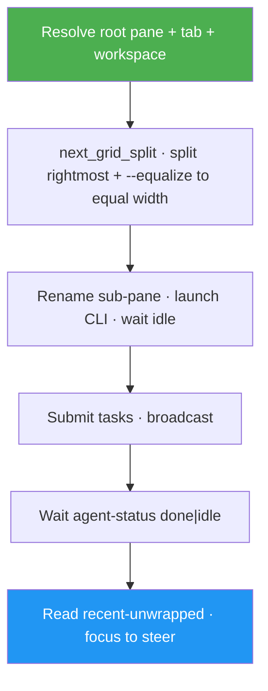

<!--
  DO NOT READ THIS FILE — This README.md is for human catalog browsing only.
  It ships inside the .skill package but is NEVER auto-loaded into agent context.
  The runtime loader only reads SKILL.md + references/ + scripts/ + agents/ when the skill triggers.
  If you're an AI agent, read the SKILL.md file instead for skill instructions.
-->

# Herdr Agent Comms

> Tile **root + sub-agents** into **one grid tab** as equal-width columns — root stays put, workers stay the same size as root, messaging via the `herdr` CLI with status-aware waits.

## Highlights

- **Root + sub-agents grid** — every column, including root, is resized to equal width as sub-agents are added.
- **Root never replaced** — orchestrator pane stays; only close worker panes on teardown.
- **Fleet spawn** — agent CLI + model + thinking + optional skills, then assign tasks in parallel.
- **Message & steer** — `pane run` / `agent send`, wait on `working` → `done`/`idle`, read transcripts.
- **Broadcast** — fan one instruction to many agents; concurrent waits.
- **Safe teardown** — close sub-panes after confirmation; never surprise `server stop` or kill root.

## When to Use

| Say this... | Skill will... |
|---|---|
| "Spin up 2 Herdr agents beside me: reviewer and tests" | Build a grid in the root tab, launch agents in equal-width columns |
| "Ask the reviewer agent what it found" | Resolve target, send, wait on status, relay reply |
| "Broadcast 'pull main' to all fleet agents" | Fan-out send + concurrent collect |
| "Focus the tests pane so I can steer" | `herdr agent focus tests` |

## How It Works



## Usage

```
/herdr-agent-comms
```

Or describe the goal — "tile a reviewer agent with my pane", "launch a Herdr fleet grid beside me".

## Popular Use Cases

### 1. Root + sub-agents grid (default)

```
/herdr-agent-comms spin up 2 pi agents in a grid with my pane:
- reviewer: thinking medium — review the last commit
- tests: thinking low — propose a minimal test plan
```

### 2. Message a running agent

```
/herdr-agent-comms ask reviewer to summarize open risks; show me the reply
```

### 3. Steer live

```
/herdr-agent-comms focus the tests agent so I can type into it
```

## Requirements

- Herdr installed (`herdr --version`) and server running (`herdr status`)
- Prefer running the orchestrator **inside** Herdr (`HERDR_ENV=1`) so `$HERDR_PANE_ID` is the root
- Agent CLIs on PATH (`pi`, `claude`, `codex`, …) as needed
- Optional: `herdr integration install <agent>` for better status

## Related

- Sibling skill: `tmux-agent-comms` (same workflow for plain tmux)
- Cheatsheet: https://luongnv.com/awesome-cheatsheets/cheatsheets/herdr/
- Docs: https://herdr.dev/docs/
